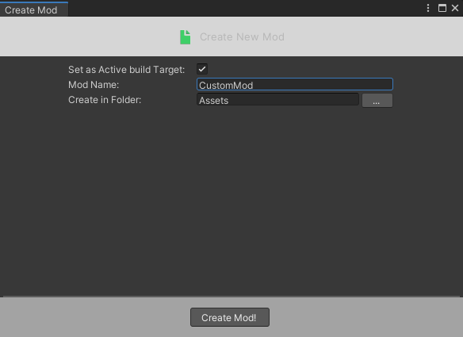
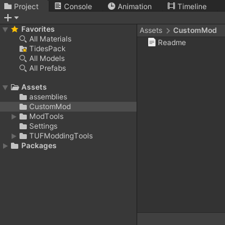
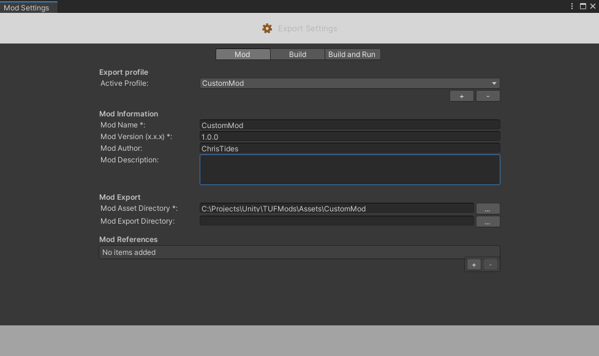
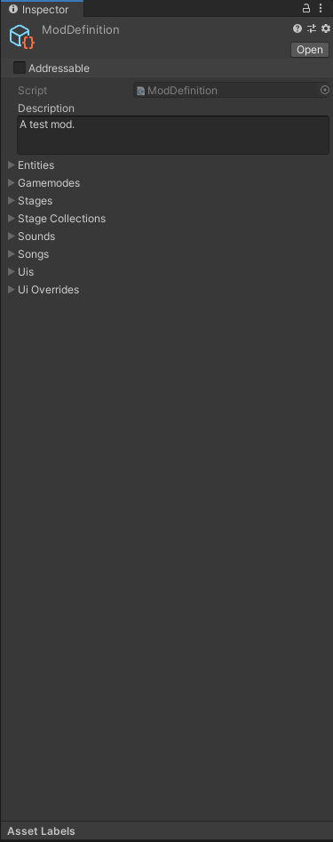

# Mod Setup

## Create Mod 
To create a new mod, you first want to go to Mod Tools>Create>New Mod.
In this menu you can name your mod and set the folder all the content will be in. 

Once you click Create Mod, you should see the folder show up in the inspector. The readme file inside the folder will give you details on the specifics of your mod and the type of content you can include.

If you go to Mod Tools>Export Settings, you'll find important information about your mod.
To identify your mod from others, the game gives it an identity of "ModAuthor.ModName", so make sure the combination is unique. 

You can also reference other mods here, which will allow you to use their code and assets in your mod.

## Create ModDefinition
Inside this folder, create a ModDefinition object through the right click menu (Create>TUF>Modding>ModDefinition). Don't rename it.
This ModDefinition is used to both identify the content in your game, and to keep track of what's currently loaded from your mod in the player's game. 

With that the setup is done, now you can get creating. 
